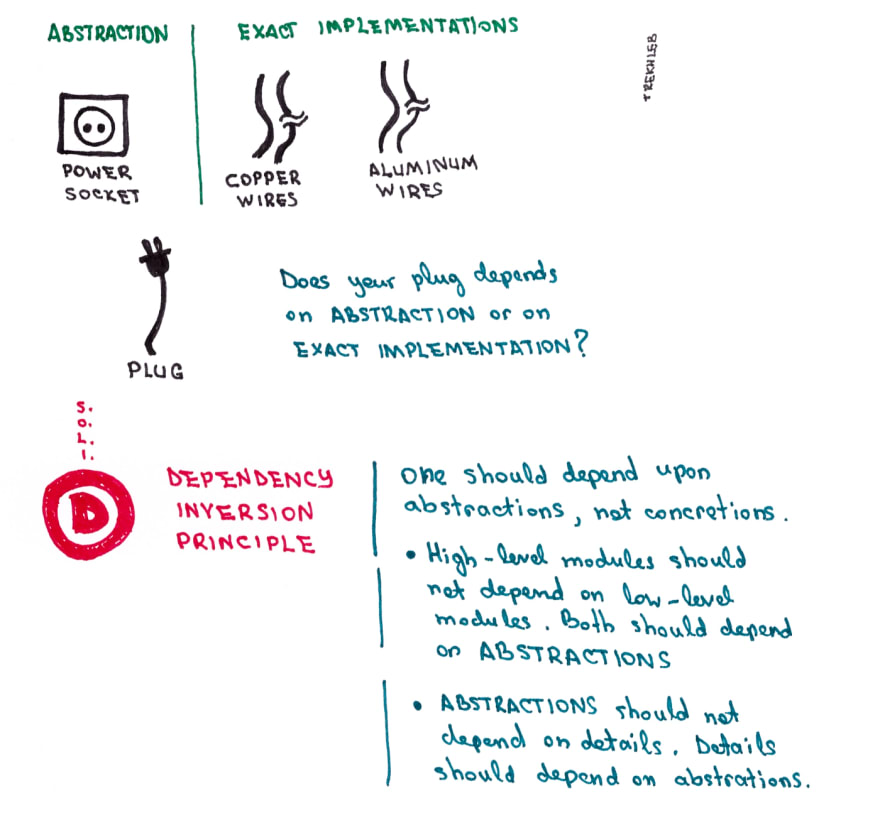

# Dependency inversion principle

**DEPEND ON ABSTRACTIONS NOT ON CONCRETIONS**

High-level modules should not depend on low-level modules. Both should depend on abstractions
Abstractions should not depend on details. Details should depend on abstractions

### Real world example


### Code

**Without DIP**
```php
class PasswordReminder
        {
            protected $dbConnection;

            // this is breaking the dependency inversion principle
            // because PasswordReminder should not know the type of the connection
            // HIGH-LEVEL MODULES SHOULD NOT DEPEND ON LOW-LEVEL MODULES
            public function __construct(MySQLConnection $dbConnection)
            {
                $this->dbConnection = $dbConnection;
            }
        }
```

**With DIP**
```php
interface ConnectionInterface
{
    public function connect();
}

class DbConnection implements ConnectionInterface
{
    // now the low-level module depends upon an the abstraction
    public function connect()
    {
        // connect to db
    }
}

// high-level module depends upon an abstraction
class PasswordReminder
{
    protected $dbConnection;

    public function __construct(ConnectionInterface $dbConnection)
    {
        $this->dbConnection = $dbConnection;
    }
}
```
