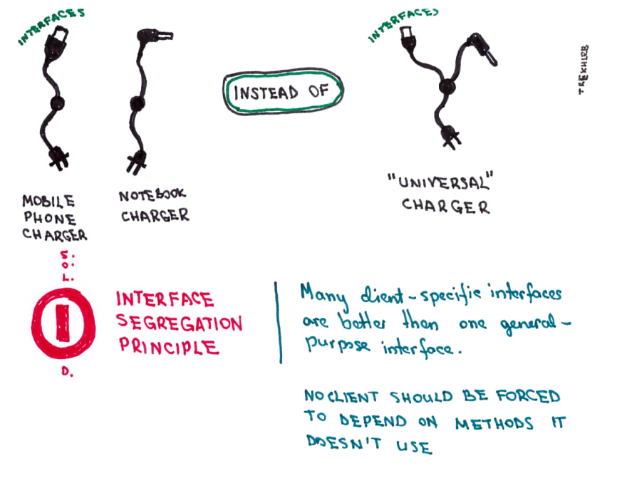

# Interface segregation principle

**A CLIENT SHOULD NOT BE FORCED TO IMPLEMENT AN INTERFACE THAT IT DOESN'T USE**

Many client-specific interfaces are better than one general-purpose interface. No client should be forced to depend on methods it does not use

### Real world example


### Code

**Without ISP**
```php
interface WorkerInterface
{
    public function work();
    public function sleep();
}

class HumanWorkker implements WorkerInterface
{
    // humans work
    public function work()
    {
        return 'human working';
    }

    // humans sleep
    public function sleep()
    {
        return 'human sleeping'
    }
}

class AndroidWorker implements WorkerInterface
{
    // androids work
    public function work()
    {
        return 'android working';
    }

    // androids don't sleep
    public function sleep()
    {
        // if we implement WorkerInterface we must also implement functions form that interface
        // so we must return null
        // this class is forced to implement function that it doesn't use
        // and this is violating INTERFACE SEGREGATION PRINCIPLE
        return null;
    }
}

class Captain
{
    public function manage(Worker $worker)
    {
        $worker->work();
        $worker->sleep();
    }
}
```

**With ISP**
```php
interface ManagebleInterface
{
    public function beManaged();
}

interface WorkableInterface
{
    public function work();
}

interface SleepableInterface
{
    public function sleep();
}

class HumanWorkker implements WorkableInterface, SleepableInterface, ManagebleInterface
{
    // humans work
    public function work()
    {
        return 'human working';
    }

    // humans sleep
    public function sleep()
    {
        return 'human sleeping'
    }

    public function beManaged()
    {
        $this->work();
        $this->sleep();
    }
}

class AndroidWorker implements WorkableInterface, ManagebleInterface
{
    // androids work
    public function work()
    {
        return 'android working';
    }

    public function beManaged()
    {
        $this->work();
    }
}

class Captain
{
    public function manage(ManagebleInterface $worker)
    {
        $worker->beManaged();
    }
}
```
