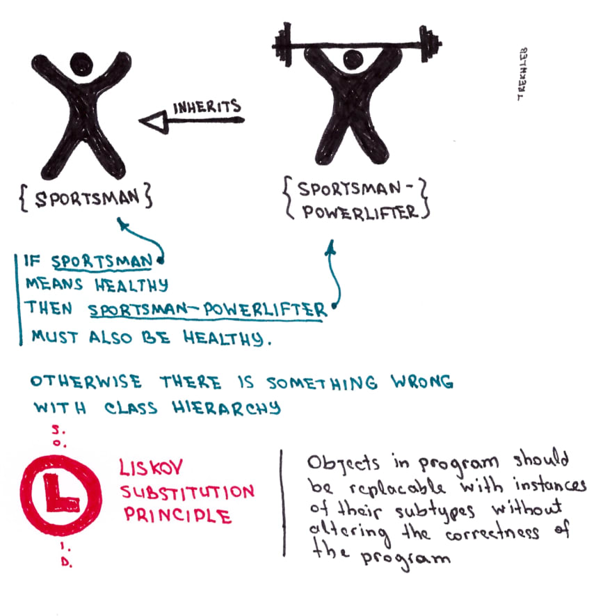

# Liskov substitution principle

**DERIVED CLASSES MUST BE SUBSTITUTABLE FOR THEIR BASE CLASSES**
**ALWAYS MAKE SURE THAT THE OUTPUT OF THE IMPLEMENTATION MATCH WHAT IS SPECIFIED IN THE CONTRACT**

Objects in a program should be replaceable with instances of their subtypes without altering the correctness of that program

### Real world example


### Code

**Without LSP**
```php
interface LessonRepositoryInterface
{
    public function getAll();
}

class FileLessonRepository implements LessonRepositoryInterface
{
    public function getAll()
    {
        // returns array
        return [];
    }
}

class DbLessonRepository implements LessonRepositoryInterface
{
    public function getAll()
    {
        // returns collection
        return Lesson::all(); // violates liskov substitution principle
        // because in FileLessonRepository implementation of the interface it returns an array
        // and here we are returning collection
        // so we have different output and that violates LSP
    }
}

function foo(LessonRepositoryInterface $lesson) {
    $lessons = $lesson->getAll();

    // if we have different outputs, we might have a scenario with conditionals
    // we are doing type checking which is breaking the SOLID principles
    // IF WE ARE DOING CHECKING WITH instanceof OR is_a, WE ARE PROBABLY BREAKING SOME PRINCIPLES
    if (is_a($lesson, 'DbLessonRepository')) {
        // do something
    } else {
        // do something
    }
}
```

**With LSP**
```php
interface LessonRepositoryInterface
{
    /**
     * Fetch all records
     *
     * @return array
     */
    public function getAll(): array;
}

class FileLessonRepository implements LessonRepositoryInterface
{
    public function getAll(): array
    {
        return [];
    }
}

class DbLessonRepository implements LessonRepositoryInterface
{
    public function getAll(): array
    {
        // this way both functions in the classes return an array
        // this fixes the violation
        return Lesson::all()->toArray();
    }
}
```
