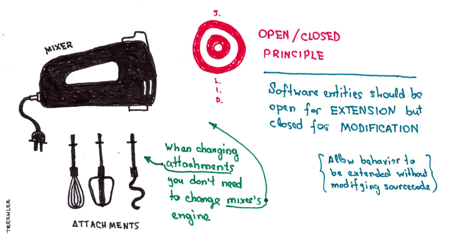

# Open closed principle

**ENTITIES SHOULD BE OPEN FOR EXTENSION, BUT CLOSED FOR MODIFICATION**

Software entities should be open for EXTENSION, but closed for MODIFICATION. Allow behaviour to be extended without modifying the source-code

### Real world example


### Code

**Without OCP**
```php
class Square
{
    public $width;
    public $height;

    public function __construct($height, $width)
    {
        $this->width = $width;
        $this->height = $height;
    }
}

class Circle
{
    public $radius;

    public function __construct($radius)
    {
        $this->radius = $radius;
    }
}

class AreaCalculator
{
    public function calculate($shapes)
    {
        foreach ($shapes as $shape) {
            // ringer that we are breaking the open-closed principle
            // when we do something like this, with conditionals
            if (is_a($shape, 'Square')) {
                $area[] = $shape->width * $shape->height;
            } else {
                $area[] = $shape->radius * $shape->radius * pi();
            }
        }

        return array_sum($area);
    }
}
```

**With OCP**
```php
interface Shape
{
    public function area();
}

class Square implements Shape {
    public $width;
    public $height;

    public function __construct($height, $width)
    {
        $this->width = $width;
        $this->height = $height;
    }

    public function area()
    {
        return $this->width * $this->height;
    }
}

class Circle implements Shape
{
    public $radius;

    public function __construct($radius)
    {
        $this->radius = $radius;
    }

    public function area()
    {
        return $this->radius * $this->radius * pi();
    }
}

class AreaCalculator
{
    public function calculate($shapes)
    {
        foreach ($shapes as $shape) {
            $area[] = $shape->area();
        }

        return array_sum($area);
    }
}
```
